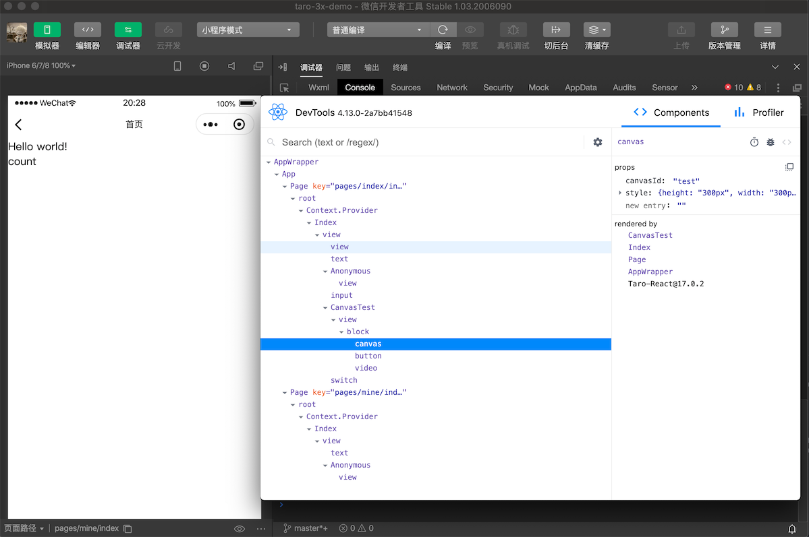

# taro-plugin-react-devtools

[Taro 3.x](https://taro-docs.jd.com/taro/docs/README) 小程序端支持 [React Devtools](https://reactjs.org/blog/2019/08/15/new-react-devtools.html) 调试

## Usage

```shell
$ yarn add taro-plugin-react-devtools -D   # npm i taro-plugin-react-devtools --save-dev
$ yarn global add react-devtools           # npm i react-devtools -g
```

<br/>
<br/>

Taro 配置:

```js
const config = {
  // ...
  plugins: ['taro-plugin-react-devtools'],
  // ...
};
```

<br/>

启动 React Devtools

```shell
$ react-devtools
```

<br/>

编译小程序:

```shell
$ yarn dev:weapp # 微信小程序
```

> 注意：只在 `process.env.NODE_ENV === 'development'` 时启用

<br/>
<br/>

在小程序开发者工具中运行后，即可在 React Devtools 中进行调试：

<br/>



<br/>

> 注意：微信和字节跳动小程序需要在 IDE 中打开「不校验合法域名」。
